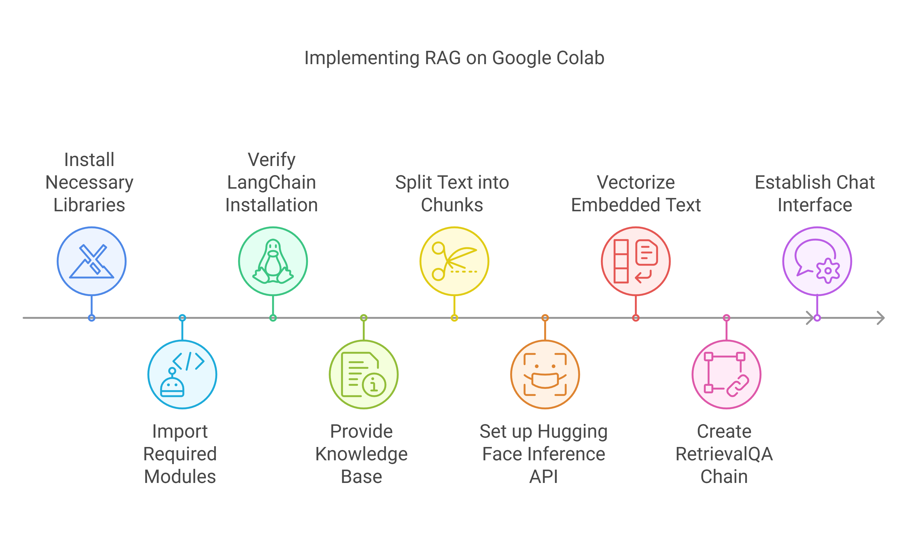

#   RAG Implementation on Google Colab

[](https://opensource.org/licenses/MIT)

This project demonstrates a Retrieval-Augmented Generation (RAG) system in Google Colab for various cyber applications. It enables users to ask questions about cyber forensics reports, threat intelligence, security documentation, or other cyber-related texts, and receive answers based on the information within those documents.

##   Dependencies

To run this project, ensure you have the following:

* **Python:** Version 3.7 or higher
* **pip:** Python package installer
* **Hugging Face Account:** Required to use Hugging Face models and Inference API.
* **Google Colab Environment:** To execute the notebook.

**Disk space:** The required disk space will largely depend on the size of the documents you process. Google Colab provides a virtual environment, so you don't need to worry about the space occupied by dependencies in the same way as a local setup.

##   What is RAG?

Retrieval-Augmented Generation (RAG) is a technique that combines information retrieval with text generation to provide more accurate, factual, and contextually relevant responses. It works by retrieving relevant information from a knowledge base and then using a language model to generate a response based on that information. This allows language models to handle complex questions and access domain-specific knowledge.

##   How this project works

This project uses the following components:

* **Hugging Face Models:** Pre-trained language models for embedding and text generation.
* **LangChain:** A framework for developing applications powered by language models.
* **FAISS:** A library for efficient similarity search and clustering of vectors.
* **Google Colab:** A cloud-based platform for running Python code.

The system works as follows:

1.  **Load and split:** The cyber forensics document is loaded and split into smaller chunks.
2.  **Embed:** Each chunk is embedded into a vector representation using a Hugging Face model.
3.  **Store:** The embeddings are stored in a FAISS index for efficient similarity search.
4.  **Query:** When a user asks a question, the question is embedded and used to search the FAISS index for relevant chunks.
5.  **Answer:** The relevant chunks are passed to a Hugging Face language model, which generates an answer based on the retrieved information.

##   Code Overview

The code is structured as follows:

* **Document loading and processing:** The cyber forensics document is loaded. It is then split into chunks using `RecursiveCharacterTextSplitter`.
* **Embedding Generation:** Embeddings are generated using Hugging Face Inference API.
* **Vectorstore creation:** A FAISS vectorstore is created using the embeddings.
* **RetrievalQA Chain:** A `RetrievalQA` chain is set up to handle question answering.
* **Chat Interface:** A simple chat interface is implemented to take user queries and display the RAG output. [cite: 44]

##   Why this approach is better

This RAG-based approach offers several advantages:

* **Contextualized responses:** The system provides answers grounded in the provided cyber forensics document, ensuring relevance and accuracy.
* **Interactive interface:** The chat-like interaction allows for a user-friendly experience.
* **Efficiency:** FAISS enables fast similarity search for retrieving relevant information.
* **Cloud-based execution:** Google Colab provides a convenient environment for running the code without requiring local setup of dependencies.
* **Hugging Face Integration:** Leveraging pre-trained models from Hugging Face simplifies the process of embedding and text generation.

##   System Workflow

The following outlines the workflow of the RAG system:

1.  **Document Loading:** Load the cyber forensics document.
2.  **Text Splitting:** Split the document into smaller chunks.
3.  **Embedding Generation:** Generate embeddings for each chunk using Hugging Face.
4.  **Vectorstore Creation:** Create a FAISS index from the embeddings.
5.  **User Query:** Receive a question from the user.
6.  **Embedding Query:** Embed the user's question.
7.  **Similarity Search:** Search the FAISS index for relevant chunks.
8.  **Answer Generation:** Use a Hugging Face language model to generate an answer based on the retrieved chunks.
9.  **Output:** Display the answer to the user.

## System Workflow

The following flowchart illustrates the workflow of the RAG system:

##   Setup and Usage

1.  **Create a Hugging Face Account (if you don't have one):**
    * Go to [https://huggingface.co/](https://huggingface.co/) and sign up.
2.  **Generate a Hugging Face Access Token:**
    * Log in to your Hugging Face account.
    * Go to your profile settings.
    * Find the "Access Tokens" section.
    * Create a new token.
    * Copy the generated token.
3.  **Open Google Colab:**
    * Open a new Google Colab notebook.
4.  **Install Python dependencies:**
    * Copy and paste the following commands into a Colab cell and run it:

        ```bash
        !pip install transformers langchain langchain_community faiss-cpu huggingface_hub pypdf
        !pip install pymupdf
        !pip install -U langchain langchain-huggingface
        !pip install --upgrade langchain
        ```
5.  **Provide Hugging Face API Token:**
    * Add a code cell to set the `HUGGINGFACEHUB_API_TOKEN` environment variable with your token:

        ```python
        import os
        os.environ['HUGGINGFACEHUB_API_TOKEN'] = 'hf_your_token' # Replace 'hf_your_token' with your actual token
        ```
6.  **Provide your knowledge base:**
    * Add a cell and define your `document_text` (knowledge base).
7.  **Run the code:**
    * Execute the cells in order. You should now be able to interact with your RAG system.

##   Features

* **Google Colab Integration:** Easy setup and execution in a cloud-based environment.
* **Hugging Face Integration:** Utilizes powerful pre-trained models for embedding and text generation.
* **FAISS Vectorstore:** Enables efficient similarity search for fast retrieval of relevant information.
* **Text Chunking:** Splits the input document into smaller, manageable chunks for better processing.
* **Chat Interface:** Provides a simple way to interact with the RAG system through text-based queries.

##   Contributing

Contributions are welcome! Feel free to open issues or pull requests for bug fixes, improvements, or new features.

##   License

This project is licensed under the MIT License.
